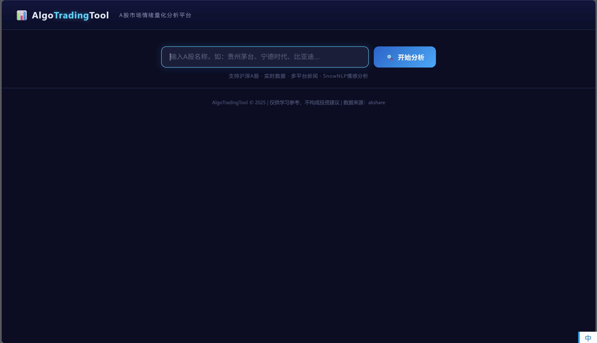
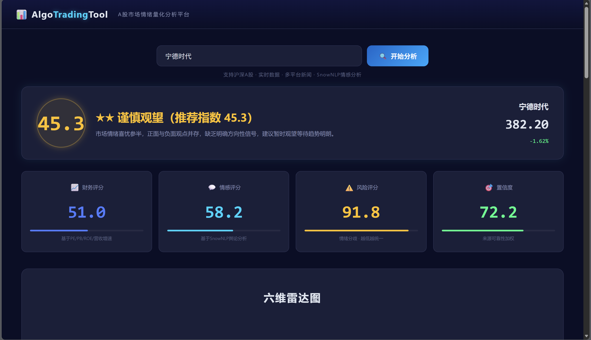
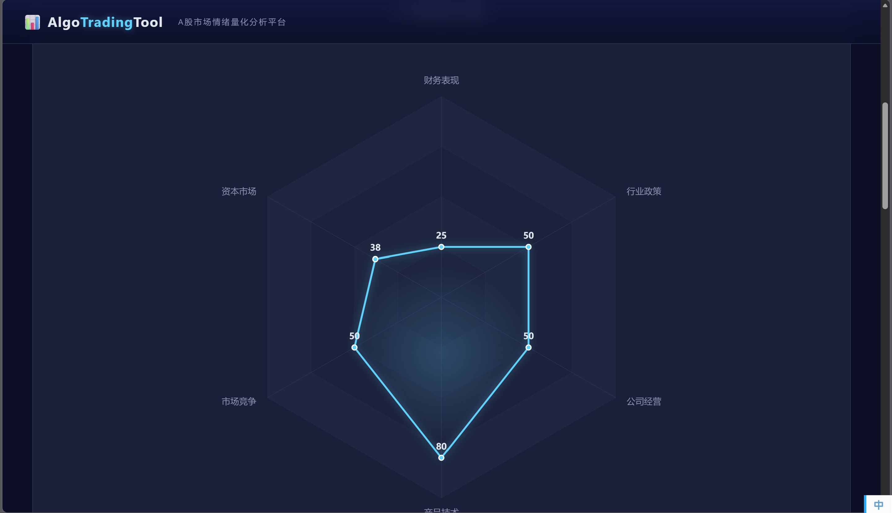
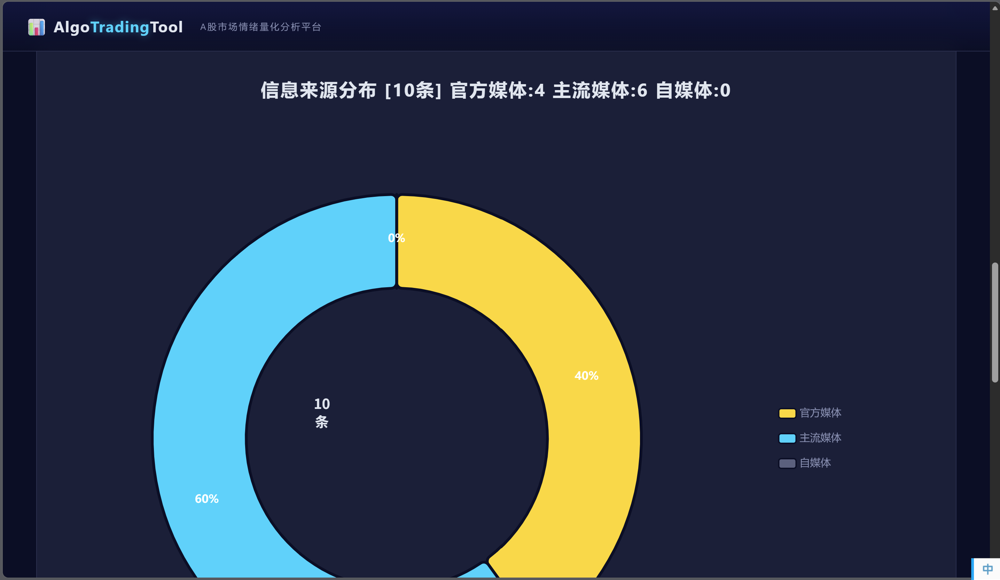
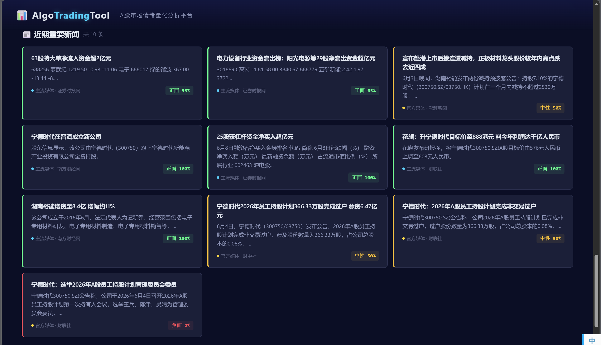

# AlgoTradingTool — A 股量化分析工具

> **GitHub 仓库**: https://github.com/erchen08/AlgoTradingTool

---

## 一、项目概述

AlgoTradingTool 是一款基于 Web 的 A 股市场情绪量化分析工具。用户输入任意 A 股名称后，系统自动抓取实时交易数据和多平台新闻，通过 SnowNLP 中文情感分析引擎量化市场舆论，最终输出一个 **0-100 的推荐指数**与多维度可视化报告。

### 核心功能

1. **智能股票搜索** — 覆盖 5527 只 A 股，支持名称/代码模糊匹配
2. **实时行情获取** — 股价、涨跌幅、均线系统（腾讯源）
3. **多平台新闻抓取** — 东方财富 + 雪球 + 公告信披
4. **SnowNLP 情感分析** — 逐条新闻情感打分，输出均值/标准差/极化指标
5. **综合推荐指数** — 财务 × 0.4 + 情感 × 0.4 + (100-风险) × 0.2
6. **六维雷达图** — 财务表现、资本市场、市场竞争、产品技术、公司经营、行业政策
7. **三分类饼图** — 官方媒体 / 主流媒体 / 自媒体，带置信度权重
8. **新闻摘要卡片** — 每条新闻一句话摘要，情感颜色标签

---

## 二、技术架构

| 层级 | 技术 |
|------|------|
| 后端 | Flask（Python） |
| 数据源 | akshare（新浪 + 腾讯双源回退） |
| 新闻抓取 | 东方财富 API |
| 分词 | jieba |
| 情感分析 | SnowNLP（朴素贝叶斯中文情感模型） |
| 前端 | HTML5 + CSS3 + 原生 JavaScript |
| 图表 | ECharts 5.x |
| 代理 | HTTP 代理自动配置 |

### 核心算法

- **朴素贝叶斯情感分类** — SnowNLP 对每条新闻计算 0~1 情感概率
- **多因子加权评分** — 三维度（财务/情感/风险）加权融合得出推荐指数
- **关键词规则分类** — 六维雷达维度 + 三分类来源分级，基于关键词词典匹配
- **Jaccard 相似度去重** — 标题 n-gram Jaccard 系数用于新闻去重
- **情感极化检测** — 标准差 + 正负比例平衡度 → 风险评分

---

## 三、界面截图

### 3.1 搜索主界面

用户在此输入 A 股名称或代码，点击"开始分析"触发全流程。



### 3.2 推荐指数与评分卡片

页面顶部显示圆形推荐指数徽章（0-100）、星级评定（★~★★★★★）、一句话总结，以及当前股价和涨跌幅。下方四张卡片分别展示财务评分、情感评分、风险评分和置信度。



### 3.3 六维雷达图

六个维度（财务表现、资本市场、市场竞争、产品技术、公司经营、行业政策）的综合得分可视化。财务表现和资本市场来自实时交易数据，其余四维来自新闻关键词分类后情感聚合。图表高度 900px，全宽展示。



### 3.4 信息来源饼图

三分类饼图展示新闻来源构成：官方媒体（金色）、主流媒体（青色）、自媒体（灰色）。来源分类结合媒体名称关键词和内容信号（如含"公告""披露"视为官方信披转载）。右侧图例显示各类别具体条数。



### 3.5 新闻摘要卡片

每条新闻以独立卡片展示，包含标题、一句话摘要、来源分类标签和情感分数。卡片左侧色带表示情感倾向：绿色=正面（>55%）、黄色=中性、红色=负面（<45%）。



---

### 数据流示意

```
用户输入股票名称
    │
    ▼
[1] akshare 搜索股票代码 → 实时行情 + K线 + 财务指标
    │
    ▼
[2] 东方财富 + 雪球 + 公告 → 新闻抓取 → 去重
    │
    ▼
[3] SnowNLP 情感分析 → 来源分级 → 维度分类
    │
    ▼
[4] 综合评分引擎 → 推荐指数
    │
    ▼
[5] ECharts 六维雷达图 + 三分类饼图 + 新闻卡片
```

---

## 四、运行方法

```bash
# 1. 安装依赖
pip install -r requirements.txt

# 2. 配置代理（编辑 src/config.py）
PROXY_PORT = 6518  # 改为你的代理端口

# 3. 启动
python src/app.py

# 4. 访问
# 浏览器打开 http://127.0.0.1:18000
```

搜索 "贵州茅台" 或 "600519" 即可看到完整分析。

---

## 五、课程知识点应用

| 知识点 | 课程关联 | 应用位置 |
|--------|---------|---------|
| 朴素贝叶斯分类 | 概率论 / 机器学习 | SnowNLP 中文情感分析 |
| 多因子加权模型 | 统计分析 / 量化金融 | 推荐指数 = 财务×0.4 + 情感×0.4 + (100-风险)×0.2 |
| 规则引擎 + 词典匹配 | 数据结构 / NLP | 六维雷达维度分类、新闻来源三分类 |
| Jaccard 相似度 | 离散数学 / 信息检索 | 新闻标题去重 |
| RESTful API | Web 开发 | Flask `@app.route` 路由设计 |
| ECharts 数据可视化 | 数据可视化 | 雷达图 + 饼图 |
| Python 异常处理与容错 | 软件工程 | 双数据源回退、代理切换、缓存策略 |
| Unicode 规范化 | 字符编码 | `unicodedata.normalize` 处理中文跨平台一致性问题 |

---

## 六、AI 工具使用声明

本项目使用 **Anthropic Claude（Claude Code）** 作为 AI 辅助编程工具。

| 模块 | AI 参与内容 |
|------|-----------|
| 前端代码 | HTML/CSS/JS 由 AI 生成 |
| Flask 后端 | API 路由和请求处理由 AI 实现 |
| 评分引擎 | 多因子加权公式由 AI 草拟并实现 |
| 分类器 | 关键词词典和规则逻辑由 AI 编写 |
| 调试 | SSL 证书、代理、端口等环境问题由 AI 排查 |
| 文档 | README 和主文档由 AI 撰写 |

**本人独立完成**：需求定义、技术选型（Flask + akshare + SnowNLP）、UI 设计风格（深色科技风）、评分维度设计（六维雷达 + 三分类来源）、全程测试验证与反馈迭代。

---

## 七、项目结构

```
AlgoTradingTool/
├── src/                    # 核心源代码
├── docs/                   # 文档、附件
├── tests/                  # 测试用例
├── README.md               # 项目主文档
├── LICENSE                 # MIT 协议
└── requirements.txt        # 环境依赖
```

---

## 八、评分体系参考

| 指数范围 | 星级 | 建议 |
|----------|------|------|
| ≥ 85 | ★★★★★ | 强烈推荐 |
| 70–84 | ★★★★ | 推荐买入 |
| 55–69 | ★★★ | 推荐买入 |
| 40–54 | ★★ | 谨慎观望 |
| < 40 | ★ | 建议回避 |

---

## 九、依赖与参考文献

### Python 依赖

```
flask>=3.0
akshare>=1.14
snownlp>=0.12.3
pandas>=2.0
numpy>=1.24
jieba>=0.42
requests>=2.31
```

### 开源组件引用

| 组件 | 用途 | 链接 |
|------|------|------|
| akshare | A 股数据接口 | https://github.com/akshare/akshare |
| SnowNLP | 中文情感分析 | https://github.com/isnowfy/snownlp |
| ECharts | 数据可视化 | https://echarts.apache.org/ |
| Flask | Web 框架 | https://flask.palletsprojects.com/ |
| jieba | 中文分词 | https://github.com/fxsjy/jieba |

### 完整技术文档

详见 [README.md](https://github.com/erchen08/AlgoTradingTool/blob/main/README.md) 和 `src/` 各模块的 docstring 注释。

---

## 十、免责声明

本工具仅供学习研究使用，**不构成任何投资建议**。股市有风险，投资需谨慎。

数据来源：akshare（新浪财经、腾讯证券、东方财富）

**License**: MIT
